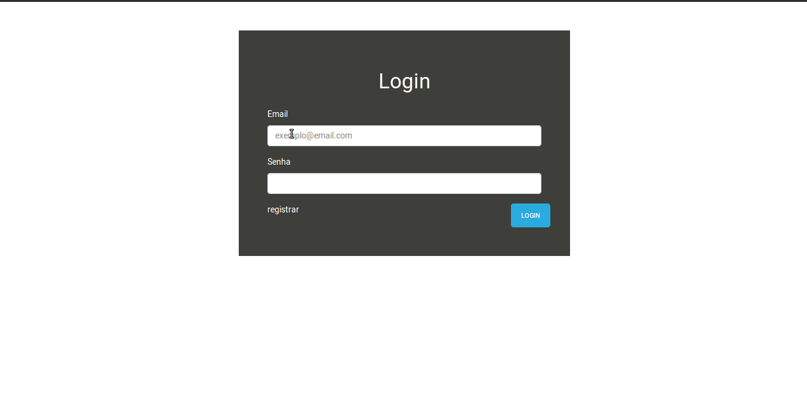

# notepad com PHP 

#### Assuntos estudados
- PHP Orientado a objetos
- Autoload Psr-4 com composer
- Login com sessions
- Chamadas Async Com Ajax (JQUERY) 
- Métodos HTTP: 'GET', 'POST', 'PUT', 'DELETE'
- Namespaces

#### tecnologias utilizadas: 
- PHP
- Composer
- MySQL
- Bootstrap 4
- Jquery
- Javascript (es5)

##### instalação
- Clone o repositório
- Abra a pasta do projeto no terminal e digite o comando `composer dump-autoload` para atualizar o carregamento das classes
- crie uma tabela no MySQL e execute os comandos no arquivo `dump.sql` 
- altere as constantes do arquivo `config.php` com as configurações do seu mysql
- mova a pasta para um servidor ex: apache e abra a url do servidor escolhido no browser

testado apenas com servidor Apache e php 7.2

#### demo
